# SECCON 2016 Online CTF

##Description
**Category:** Crypto **Points:** 300 **Solved:** 14

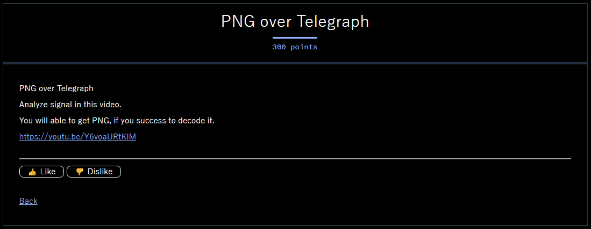

##Solution
To solve this challenge, we need to know how to decode tower's posture in video into message.
First, I clicked the [link](https://youtu.be/Y6voaURtKlM) from the challenge to see an interesting video.
At the beginning of the video we'll see someone show how to decode signal tower to message.

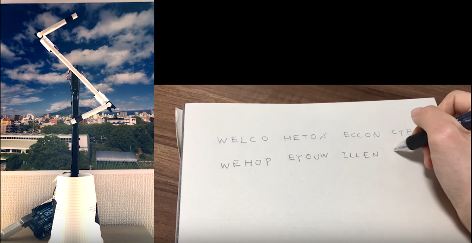

He'll decode just some character and we have to find out what kind of communication system for conveying a message.
After awhile, my team mate did google and found it's a ['Sémaphore'](https://fr.wikipedia.org/wiki/S%C3%A9maphore_(communication)).

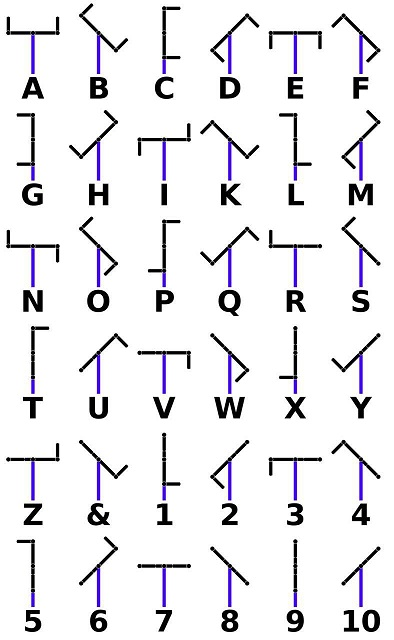

Next step, we have to download vdo and try to extract frames.
I used ['ffmpeg'](https://ffmpeg.org) to extract frames every 1 second.
After trying several times, I found that 00:01:15.790 was the best start time for the first frame.

`ffmpeg -i seccontower.mp4 -ss 00:01:15.790 -r 1 out/img%04d.jpg`

Then I got all frames(2992 frames).

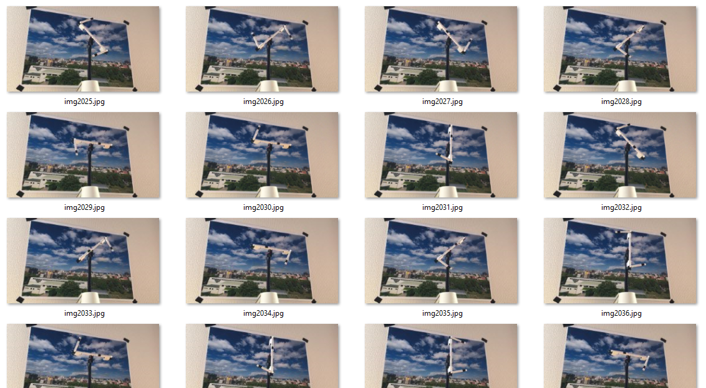

After that, I selected image which would be a training set for each posture
(3 images in range 300, 1300, 2300 per posture)
and tried to decode image by comparing hash value with library ['imagehash'](https://pypi.python.org/pypi/ImageHash) in python.

Unfortunately, there're too many error in result.
I replayed the vdo with very fast speed and noticed that the camera was panning up and light had a bit changed when recording.

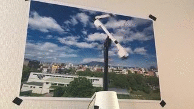

So I had to do preprocess for better result by croping image as below.

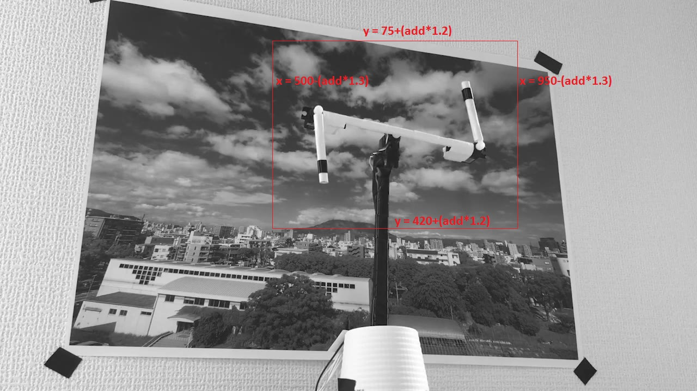

'add' was a variable which will be added by 1 every 200 frames.
Then I did a Gaussian Blur and made it to binary image by threshold = 185-add*1.6

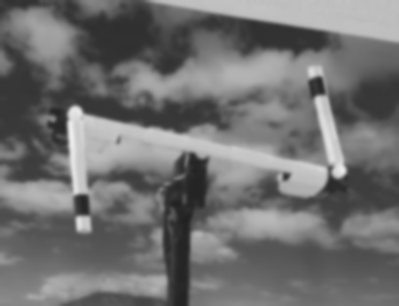

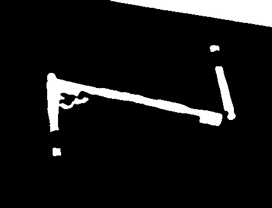

I created a below image.

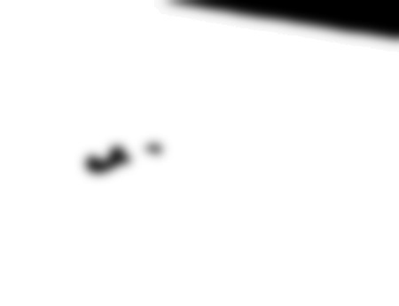

Then combined with previous image and made it to binary image again by threshold = 255.

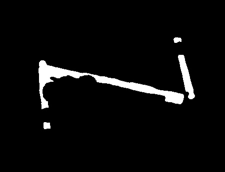

It looks pretty good.

Then I tried to decode again and grouped each image into folder to check error more easily.

Actually, it could be done here. We can decode result with Base32, write it to png file 
and open it on Windows(Linux does not work). We will get flag in QR code image. 
Or encode with Base64, put it in Image tag, save it to html file and open it with Chrome(Firefox does not work).

It seems like Windows and Chrome try to show QR code image even 'Check value' for zlib or CRC for IDAT chunk are incorrect.

I checked png file with pngcheck and found that CRC for IDAT chunk is incorrect (Assume that CRC data(0xD912FF2C) after IDAT chunk data is correct).

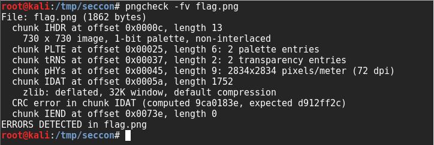

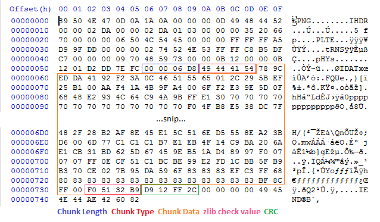

So I looked at each folder and found only 1 error at group 'J' (img2096.jpg) that should be decoded to 'B'.

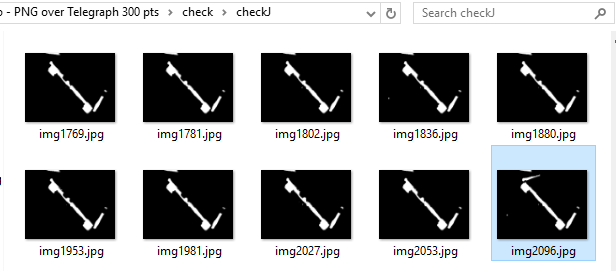

Then I changed code to fix this error and tried to decode again.
PNG was correct now.
After that I read png and decoded QR code with ['zbarimg'](http://zbar.sourceforge.net) and got a flag.
That's all the process.

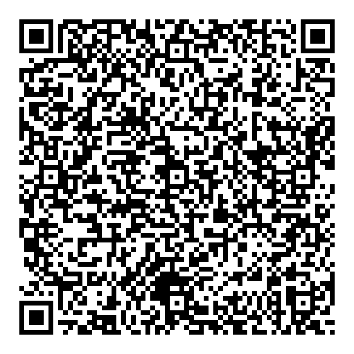

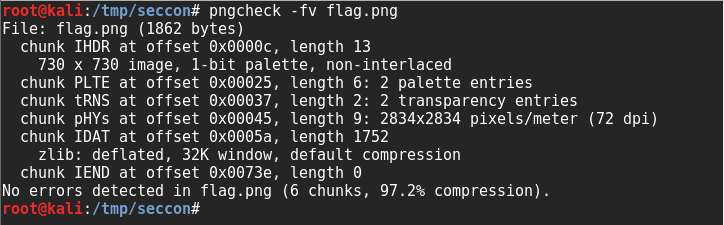

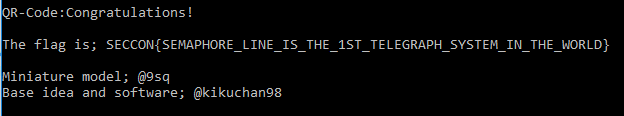

Reference
https://www.w3.org/TR/2003/REC-PNG-20031110/#13Decoders.Errors
http://www.libpng.org/pub/png/spec/1.2/png-1.2.pdf